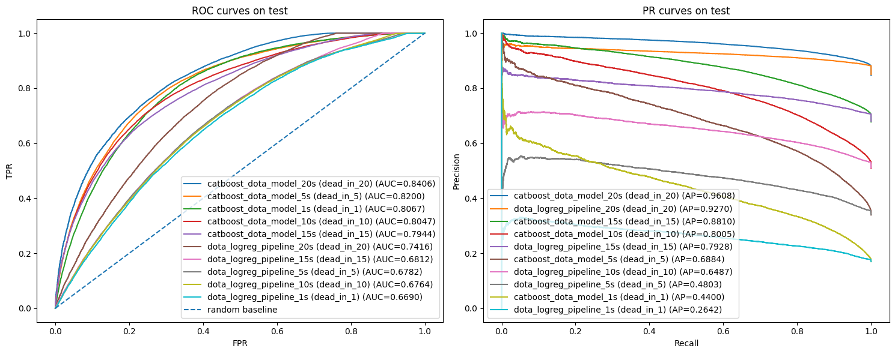

| model                    | model_id                                         | file                                             | format   | target_col   |   target_seconds | split_strategy       | threshold_strategy   |   threshold |   train_rows |   val_rows |   test_rows |   val_roc_auc |   val_pr_auc |   val_logloss |   test_logloss |   test_roc_auc |   test_pr_auc |   test_brier |   test_accuracy |   test_precision |   test_recall |   test_f1 |
|:-------------------------|:-------------------------------------------------|:-------------------------------------------------|:---------|:-------------|-----------------:|:---------------------|:---------------------|------------:|-------------:|-----------:|------------:|--------------:|-------------:|--------------:|---------------:|---------------:|--------------:|-------------:|----------------:|-----------------:|--------------:|----------:|
| catboost_dota_model_1s   | artifacts/boosting/catboost_dota_model_1s.cbm    | artifacts/boosting/catboost_dota_model_1s.cbm    | cbm      | dead_in_1    |                1 | manual_group_shuffle | grid_f1              |   0.245     |       440147 |     184038 |       90343 |      0.809828 |     0.439192 |      0.362936 |       0.365229 |       0.806717 |      0.44001  |    0.115257  |        0.772622 |         0.394239 |      0.635141 |  0.486501 |
| dota_logreg_pipeline_1s  | artifacts/logreg/dota_logreg_pipeline_1s.joblib  | artifacts/logreg/dota_logreg_pipeline_1s.joblib  | joblib   | dead_in_1    |                1 | group_shuffle_split  | prcurve_f1           |   0.520301  |       527982 |      93944 |       92602 |      0.669436 |     0.266902 |      0.649428 |       0.649152 |       0.668971 |      0.264175 |    0.232079  |        0.612006 |         0.250136 |      0.639926 |  0.35968  |
| catboost_dota_model_5s   | artifacts/boosting/catboost_dota_model_5s.cbm    | artifacts/boosting/catboost_dota_model_5s.cbm    | cbm      | dead_in_5    |                5 | manual_group_shuffle | grid_f1              |   0.335     |       440147 |     184038 |       90343 |      0.822187 |     0.690136 |      0.481501 |       0.484114 |       0.820007 |      0.688413 |    0.160161  |        0.740943 |         0.591663 |      0.762101 |  0.666153 |
| dota_logreg_pipeline_5s  | artifacts/logreg/dota_logreg_pipeline_5s.joblib  | artifacts/logreg/dota_logreg_pipeline_5s.joblib  | joblib   | dead_in_5    |                5 | group_shuffle_split  | prcurve_f1           |   0.459512  |       527982 |      93944 |       92602 |      0.678926 |     0.485898 |      0.643022 |       0.642284 |       0.678216 |      0.480331 |    0.227761  |        0.561835 |         0.425461 |      0.817896 |  0.559747 |
| catboost_dota_model_10s  | artifacts/boosting/catboost_dota_model_10s.cbm   | artifacts/boosting/catboost_dota_model_10s.cbm   | cbm      | dead_in_10   |               10 | manual_group_shuffle | grid_f1              |   0.375     |       440147 |     184038 |       90343 |      0.806381 |     0.801266 |      0.532407 |       0.534041 |       0.804698 |      0.800492 |    0.18001   |        0.716835 |         0.680983 |      0.833591 |  0.749599 |
| dota_logreg_pipeline_10s | artifacts/logreg/dota_logreg_pipeline_10s.joblib | artifacts/logreg/dota_logreg_pipeline_10s.joblib | joblib   | dead_in_10   |               10 | group_shuffle_split  | prcurve_f1           |   0.411738  |       527982 |      93944 |       92602 |      0.679743 |     0.656929 |      0.637178 |       0.638251 |       0.676372 |      0.64875  |    0.225037  |        0.6026   |         0.569532 |      0.908066 |  0.700018 |
| catboost_dota_model_15s  | artifacts/boosting/catboost_dota_model_15s.cbm   | artifacts/boosting/catboost_dota_model_15s.cbm   | cbm      | dead_in_15   |               15 | manual_group_shuffle | grid_f1              |   0.41      |       440147 |     184038 |       90343 |      0.795579 |     0.881203 |      0.49022  |       0.490437 |       0.79444  |      0.881044 |    0.163349  |        0.744507 |         0.740373 |      0.959181 |  0.835692 |
| dota_logreg_pipeline_15s | artifacts/logreg/dota_logreg_pipeline_15s.joblib | artifacts/logreg/dota_logreg_pipeline_15s.joblib | joblib   | dead_in_15   |               15 | group_shuffle_split  | prcurve_f1           |   0.0148457 |       527982 |      93944 |       92602 |      0.684811 |     0.799075 |      0.622617 |       0.623889 |       0.681177 |      0.792759 |    0.217992  |        0.716118 |         0.705718 |      0.999476 |  0.827294 |
| catboost_dota_model_20s  | artifacts/boosting/catboost_dota_model_20s.cbm   | artifacts/boosting/catboost_dota_model_20s.cbm   | cbm      | dead_in_20   |               20 | manual_group_shuffle | grid_f1              |   0.475     |       440147 |     184038 |       90343 |      0.841172 |     0.960535 |      0.296733 |       0.294405 |       0.840575 |      0.960836 |    0.0872973 |        0.888071 |         0.886396 |      0.995278 |  0.937686 |
| dota_logreg_pipeline_20s | artifacts/logreg/dota_logreg_pipeline_20s.joblib | artifacts/logreg/dota_logreg_pipeline_20s.joblib | joblib   | dead_in_20   |               20 | group_shuffle_split  | prcurve_f1           |   0.0126664 |       527982 |      93944 |       92602 |      0.741348 |     0.929435 |      0.548855 |       0.548939 |       0.74161  |      0.926999 |    0.18364   |        0.885758 |         0.881508 |      0.999987 |  0.937017 |