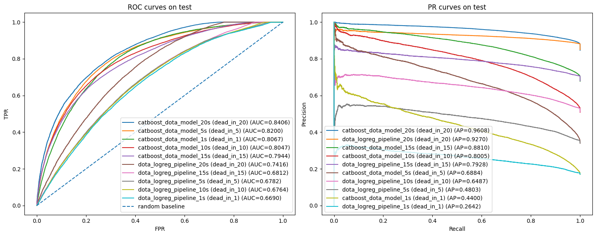

| model                    | model_id                                         | file                                             | format   | target_col   |   target_seconds | split_strategy       | threshold_strategy   |   threshold |   train_rows |   val_rows |   test_rows |   val_roc_auc |   val_pr_auc |   val_logloss |   test_logloss |   test_roc_auc |   test_pr_auc |   test_brier |   test_accuracy |   test_precision |   test_recall |   test_f1 |
|:-------------------------|:-------------------------------------------------|:-------------------------------------------------|:---------|:-------------|-----------------:|:---------------------|:---------------------|------------:|-------------:|-----------:|------------:|--------------:|-------------:|--------------:|---------------:|---------------:|--------------:|-------------:|----------------:|-----------------:|--------------:|----------:|
| catboost_dota_model_1s   | artifacts/boosting/catboost_dota_model_1s.cbm    | artifacts/boosting/catboost_dota_model_1s.cbm    | cbm      | dead_in_1    |                1 | manual_group_shuffle | grid_f1              |   0.245     |       440147 |     184038 |       90343 |      0.809828 |     0.439192 |      0.362936 |       0.365229 |       0.806717 |      0.44001  |    0.115257  |        0.772622 |         0.394239 |      0.635141 |  0.486501 |
| dota_logreg_pipeline_1s  | artifacts/logreg/dota_logreg_pipeline_1s.joblib  | artifacts/logreg/dota_logreg_pipeline_1s.joblib  | joblib   | dead_in_1    |                1 | group_shuffle_split  | prcurve_f1           |   0.520301  |       527982 |      93944 |       92602 |      0.669436 |     0.266902 |      0.649428 |       0.649152 |       0.668971 |      0.264175 |    0.232079  |        0.612006 |         0.250136 |      0.639926 |  0.35968  |
| catboost_dota_model_5s   | artifacts/boosting/catboost_dota_model_5s.cbm    | artifacts/boosting/catboost_dota_model_5s.cbm    | cbm      | dead_in_5    |                5 | manual_group_shuffle | grid_f1              |   0.335     |       440147 |     184038 |       90343 |      0.822187 |     0.690136 |      0.481501 |       0.484114 |       0.820007 |      0.688413 |    0.160161  |        0.740943 |         0.591663 |      0.762101 |  0.666153 |
| dota_logreg_pipeline_5s  | artifacts/logreg/dota_logreg_pipeline_5s.joblib  | artifacts/logreg/dota_logreg_pipeline_5s.joblib  | joblib   | dead_in_5    |                5 | group_shuffle_split  | prcurve_f1           |   0.459512  |       527982 |      93944 |       92602 |      0.678926 |     0.485898 |      0.643022 |       0.642284 |       0.678216 |      0.480331 |    0.227761  |        0.561835 |         0.425461 |      0.817896 |  0.559747 |
| catboost_dota_model_10s  | artifacts/boosting/catboost_dota_model_10s.cbm   | artifacts/boosting/catboost_dota_model_10s.cbm   | cbm      | dead_in_10   |               10 | manual_group_shuffle | grid_f1              |   0.375     |       440147 |     184038 |       90343 |      0.806381 |     0.801266 |      0.532407 |       0.534041 |       0.804698 |      0.800492 |    0.18001   |        0.716835 |         0.680983 |      0.833591 |  0.749599 |
| dota_logreg_pipeline_10s | artifacts/logreg/dota_logreg_pipeline_10s.joblib | artifacts/logreg/dota_logreg_pipeline_10s.joblib | joblib   | dead_in_10   |               10 | group_shuffle_split  | prcurve_f1           |   0.411738  |       527982 |      93944 |       92602 |      0.679743 |     0.656929 |      0.637178 |       0.638251 |       0.676372 |      0.64875  |    0.225037  |        0.6026   |         0.569532 |      0.908066 |  0.700018 |
| catboost_dota_model_15s  | artifacts/boosting/catboost_dota_model_15s.cbm   | artifacts/boosting/catboost_dota_model_15s.cbm   | cbm      | dead_in_15   |               15 | manual_group_shuffle | grid_f1              |   0.41      |       440147 |     184038 |       90343 |      0.795579 |     0.881203 |      0.49022  |       0.490437 |       0.79444  |      0.881044 |    0.163349  |        0.744507 |         0.740373 |      0.959181 |  0.835692 |
| dota_logreg_pipeline_15s | artifacts/logreg/dota_logreg_pipeline_15s.joblib | artifacts/logreg/dota_logreg_pipeline_15s.joblib | joblib   | dead_in_15   |               15 | group_shuffle_split  | prcurve_f1           |   0.0148457 |       527982 |      93944 |       92602 |      0.684811 |     0.799075 |      0.622617 |       0.623889 |       0.681177 |      0.792759 |    0.217992  |        0.716118 |         0.705718 |      0.999476 |  0.827294 |
| catboost_dota_model_20s  | artifacts/boosting/catboost_dota_model_20s.cbm   | artifacts/boosting/catboost_dota_model_20s.cbm   | cbm      | dead_in_20   |               20 | manual_group_shuffle | grid_f1              |   0.475     |       440147 |     184038 |       90343 |      0.841172 |     0.960535 |      0.296733 |       0.294405 |       0.840575 |      0.960836 |    0.0872973 |        0.888071 |         0.886396 |      0.995278 |  0.937686 |
| dota_logreg_pipeline_20s | artifacts/logreg/dota_logreg_pipeline_20s.joblib | artifacts/logreg/dota_logreg_pipeline_20s.joblib | joblib   | dead_in_20   |               20 | group_shuffle_split  | prcurve_f1           |   0.0126664 |       527982 |      93944 |       92602 |      0.741348 |     0.929435 |      0.548855 |       0.548939 |       0.74161  |      0.926999 |    0.18364   |        0.885758 |         0.881508 |      0.999987 |  0.937017 |


## 📋 Содержание
- [О проекте](#-о-проекте)
- [Архитектура и микросервисы](#-архитектура-и-микросервисы)
- [Пайплайн данных и генерация признаков](#-пайплайн-данных-и-генерация-признаков)
- [Модели машинного обучения и результаты](#-модели-машинного-обучения-и-результаты)
- [Технологический стек](#-технологический-стек)
- [Установка и быстрый старт](#-установка-и-быстрый-старт)
- [Справочник API и эндпоинты](#-справочник-api-и-эндпоинты)
- [Авторы и благодарности](#-авторы-и-благодарности)

---

## 🎯 О проекте

Этот проект представляет собой законченную, отказоустойчивую, событийно-ориентированную микросервисную систему, которая анализирует матчи Dota 2 в реальном времени и предсказывает вероятность смерти персонажа на будущих временных горизонтах (**1, 5, 10, 15 и 20 секунд**). Система визуализирует опасные зоны карты в виде интерактивной **тепловой карты 32×32**, накладываемой на мини-карту Dota 2.

### Основные цели:
1. **Автоматический парсинг реплеев и построение датасета:** Высокопроизводительный конкурентный парсер на Go, обрабатывающий сырые логи матчей в формате JSONL из OpenDota.
2. **Классификация с помощью машинного обучения:** Обучение надежных моделей бинарной классификации (CatBoost против логистической регрессии) для различных временных горизонтов с тщательной борьбой с дисбалансом классов и предотвращением утечки данных.
3. **Обработка GSI в реальном времени:** Обработка игровой телеметрии в реальном времени через интерфейс Game State Integration (GSI) от Valve.
4. **Инференс и WebSocket-стриминг:** Распределенный конвейер инференса через Redis Streams, доставляющий матрицы вероятностей в реальном времени.
5. **Интерактивный фронтенд:** Легковесное SPA-приложение (React 18, TypeScript, Vite) для управления сеансами, конфигурацией и отрисовки тепловой карты в реальном времени.

---

## 🏗 Архитектура и микросервисы

Система построена на основе разделенной микросервисной архитектуры, координируемой через **PostgreSQL** (историческая аналитика и датасет) и **Redis** (состояние сеансов, кэширование и **Redis Streams** для событийно-ориентированного обмена сообщениями).

```
[Dota 2 Client / GSI] 
       │ (HTTP POST /gsi-input)
       ▼
[GSI Processor Service (Python/FastAPI)] 
       │ (Публикация в Redis Stream: inference:input)
       ▼
[ML Inference Service (Python/FastAPI + CatBoost)] 
       │ (Обновление Redis: heat_map:<token>)
       ▼
[Backend Service (Go / Chi / Redis)] 
       │ (WebSocket /ws/predictions)
       ▼
[Frontend Web App (React 18 + Vite + Nginx)]
```

### Основные компоненты:
1. **Парсер и построитель датасета (Go):** Использует паттерн *Worker Pool*, масштабируемый до `runtime.NumCPU()`. Разделяет каждый матч на 3 конкурентные горутины (трекинг состояния героев, видение Radiant, видение Dire) и выгружает чистые векторы признаков в PostgreSQL в рамках одной транзакции.
2. **GSI Processor (`gsi_processor`):** Микросервис на FastAPI, принимающий состояния игры в реальном времени через GSI, проверяющий схемы через Pydantic, контролирующий активные токены сеансов, поддерживающий снимки скользящего окна в Redis и отправляющий записи в Redis Streams.
3. **Inference Service (`inference_service`):** Потребитель Redis Streams, загружающий предобученные артефакты моделей (`CatBoost` / `Logistic Regression`), формирующий пакетные предсказания для позиции героя или по всей сетке 32×32 и записывающий вычисленные тепловые карты в Redis.
4. **Backend Service (`backend`):** Сервис на Go 1.24 с использованием `go-chi`. Управляет REST-эндпоинтами (`/api/start`, `/api/stop`, `/health`) и WebSocket-стримингом (`/ws/predictions`) с 60-минутным TTL сеансов в Redis.
5. **Frontend (`frontend`):** Приложение на React 18 / TypeScript, отрисовывающее тепловые карты в реальном времени с помощью HTML5 `ImageData` на `Canvas`, управляющее состояниями подключения и генерирующее файлы конфигурации VDF.

---

## 📊 Пайплайн данных и генерация признаков

Датасет содержит **~700 000 снимков состояния матча**, извлеченных из 2 000 матчей. Каждая запись представлена **105 признаками**, разделенными на 7 семантических групп:

1. **Контекст матча и глобальные признаки:** `match_id`, `game_time`, `is_day`, `is_radiant`, `radiant_score`, `dire_score`.
2. **Состояние героя:** `hero_id`, `level`, `kills`, `deaths`, `assists`, `last_hits`, `denies`, `gold`, `net_worth`, `xp`, `health`, `mana`, `max_health`, `max_mana`, атрибуты (`strength`, `agility`, `intellect`), `magical_resistance`, `armor`, `bkb_cooldown`, `movespeed`, пространственные координаты (`x`, `y`, `square`).
3. **Способности:** 16 признаков, отслеживающих уровень, дальность применения, стоимость маны и перезарядку всех 4 основных способностей героя (`ability1_level` и др.).
4. **Окружение и видение:** Расстояние до ближайшей башни союзников/врагов (`nearest_ally_tower_distance`, `nearest_enemy_tower_distance`). Симуляция истинного видения, радиусов дня/ночи, невидимости, дымов (Smoke) и блокировки ландшафтом/деревьями.
5. **Матрица угроз врагов (`enemy_1` — `enemy_5`):** Для каждого из 5 вражеских героев: имя героя, координаты последнего появления (`last_seen_x`, `last_seen_y`), квадрат карты, расстояние и время с момента последнего наблюдения.
6. **Инвентарь / Предметы (бинарные флаги):** `item_black_king_bar`, `item_blink`, `item_force_staff`, `item_basher`, `item_abyssal_blade`, `item_nullifier`, `item_lotus_orb`, `item_travel_boots`, `item_tpscroll`, `item_phase_boots`, `item_silver_edge`, `item_heart`, `item_sphere`, `item_manta`, `item_blade_mail`, `item_aeon_disk`, `item_pipe`.
7. **Целевые переменные (Target):** Бинарные флаги, указывающие на смерть в течение следующих 1, 5, 10, 15 или 20 секунд.

---

## 🤖 Модели машинного обучения и результаты

Модели бинарной классификации были обучены для 5 различных временных горизонтов (1с, 5с, 10с, 15с, 20с). Разбиение данных выполнялось строго с группировкой по `match_id` для предотвращения утечки данных. Дисбаланс классов решался оптимизацией `class_weight` и контролируемой негативной выборкой (приблизительно 87.5% положительных событий смерти против 12.5% случайных интервалов простоя).


### Основные выводы:
- **CatBoost** стабильно превосходил логистическую регрессию по всем метрикам и временным горизонтам благодаря превосходной обработке нелинейных взаимодействий, категориальных признаков (One-Hot Encoded ID героев) и устойчивости к шумам.
- **Скорость инференса:** Среднее время инференса для одной ячейки модели `catboost_20s` составило **5.58 мс** (на CPU Intel Core i5-13420H), что с запасом укладывается в требования реального времени (<10 мс).
- **Сложность горизонта 1с:** Предсказание смерти ровно за 1 секунду оказалось наиболее сложным (более низкие ROC-AUC / PR-AUC) из-за внезапного и непредсказуемого характера ганков и взрывного урона, в то время как более длинные горизонты (15–20с) показали высокую стабильность предсказаний.

---

## 🛠 Технологический стек

- **Языки программирования:** Go 1.24, Python 3.10+
- **Бэкенд и API:** Go (роутер Chi, WebSockets), Python (FastAPI, Pydantic)
- **Машинное обучение:** CatBoost, Scikit-Learn, Pandas, NumPy
- **Хранилище и очереди сообщений:** PostgreSQL 16 (реляционная БД и датасет), Redis и Redis Streams (брокер событий и кэш состояний)
- **Фронтенд:** React 18, TypeScript, Vite, Nginx (паттерн BFF)
- **Инфраструктура:** Docker, Docker Compose

---

## 🚀 Установка и быстрый старт

### Системные требования
- Docker & Docker Compose
- Go 1.24+ (для локальной разработки парсера/бэкенда)
- Python 3.10+ (для обучения и ML-микросервисов)

### Запуск через Docker Compose
```bash
# Клонирование репозитория
git clone https://github.com/your-username/dota2-death-prediction.git
cd dota2-death-prediction

# Настройка переменных окружения (например, директория логов матчей)
export MATCHES_DIR="./data/matches"

# Сборка и запуск всех сервисов (PostgreSQL, Redis, GSI Processor, Inference, Backend, Frontend)
docker-compose up --build
```

---
